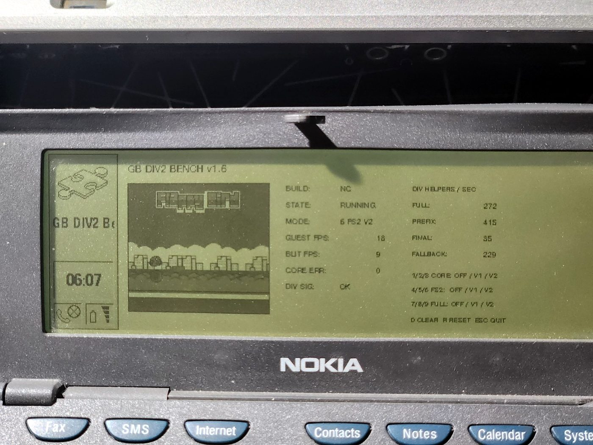
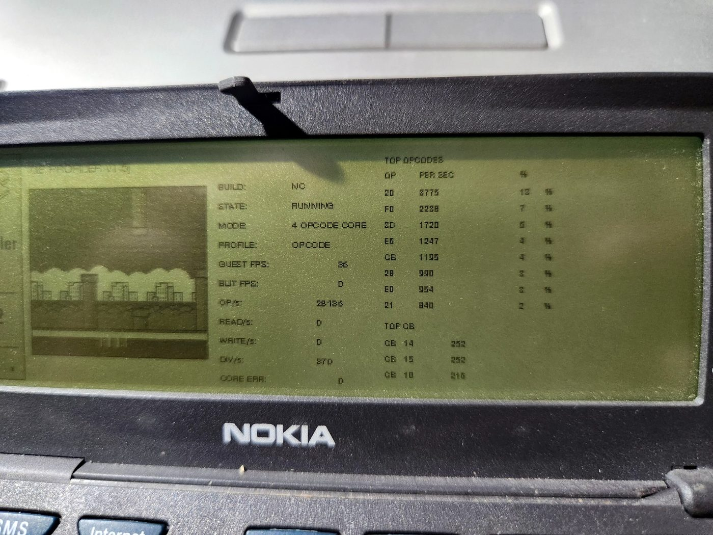
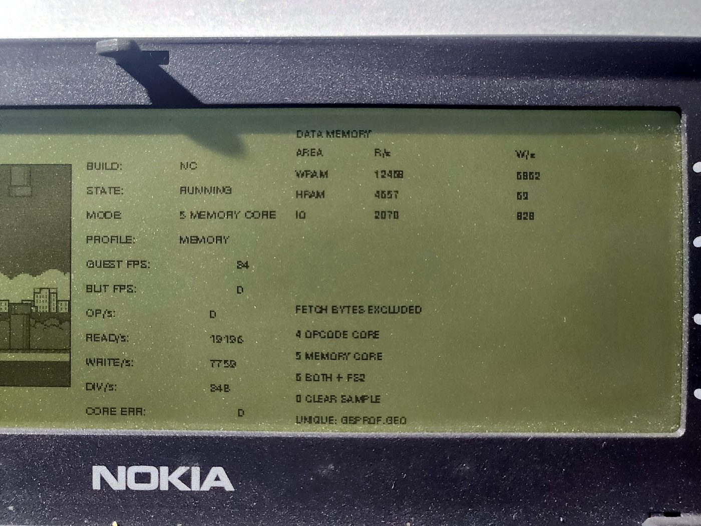
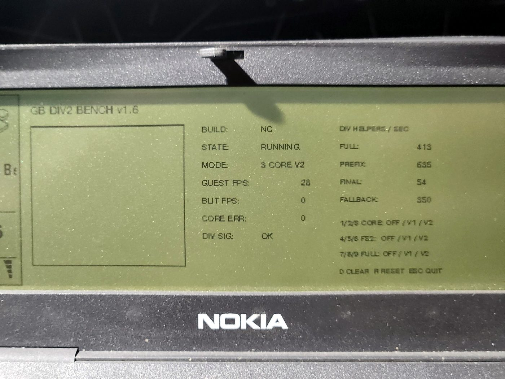

# GB9110

**An AI-assisted, hardware-verified Game Boy emulator experiment for the Nokia 9110 Communicator and PC/GEOS.**

[Русская версия](README_RU.md)



GB9110 ports the compact [Peanut-GB](https://github.com/deltabeard/Peanut-GB) core to the late-1990s Nokia 9110 SDK and Borland C++ 4.52 environment.

The project is beyond a proof-of-concept:

- a real DMG ROM is loaded from the communicator filesystem;
- the adapted LR35902 core runs on an actual Nokia 9110;
- Game Boy video is rendered into a GEOS 160×144 4-bpp bitmap;
- controls are mapped to the communicator keyboard;
- CPU, rendering, packing, GEOS blitting, opcodes and memory traffic have been profiled on hardware;
- the complete render-every-frame path improved from **5 FPS to 13 FPS**;
- fixed frame skip now reaches **18 guest FPS / 9 display FPS**;
- the current CPU-only path reaches **28 guest FPS**.

This is still **not a general-purpose emulator release**. The immediate goal is to make one small open-source homebrew ROM correct and meaningfully playable before broadening cartridge compatibility.

## Current hardware result

The current benchmark line combines ROW8 rendering, fixed frame skip and the layered DIV v2 helper.

| Path | Real Nokia 9110 result |
|---|---:|
| First complete path | 5 guest/display FPS |
| GBTABLE v0.6 | 9 guest/display FPS |
| GBROW v1.3 | 12 guest/display FPS |
| GBROW v1.3 + DIV v1 | **13 guest/display FPS** |
| GBFS v1.4c, FS2 | **18 guest / 9 display FPS** |
| GBFS v1.4c, FS3 | 21 guest / 7 display FPS |
| GBDIV2 v1.6, CPU only | **28 guest FPS** |
| Static GEOS 160×144 4-bpp blit | 44 FPS |

Frame skip does not skip guest execution: CPU, timers, input and game logic continue every guest frame; rendering and GEOS blitting are omitted together on selected frames.

## Current profiler

`GBPROF v1.5j` measures the post-ROW8 workload directly on the communicator. Opcode fetch bytes are excluded from the memory-region profile so data traffic can be inspected separately.



A representative opcode-core window measured **28,126 opcodes/s**. The hottest instructions were:

```text
20  JR NZ,r8       13%
F0  LDH A,(a8)      7%
80  ADD A,B         6%
E6  AND d8          4%
C6  ADD A,d8        4%
28  JR Z,r8         3%
E0  LDH (a8),A      3%
21  LD HL,d16       3%
```

The corresponding memory-core window measured:

```text
19,135 data reads/s
 7,759 data writes/s

WRAM  12,408 reads / 6,862 writes
HRAM   4,657 reads /    69 writes
I/O    2,070 reads /   828 writes
```



See [HARDWARE_PROFILE.md](docs/HARDWARE_PROFILE.md) and [BENCHMARKS.md](BENCHMARKS.md).

## DIV v2 result

The original DIV helper collapsed one complete ROM-specific division-loop iteration when a long timing window was safe. DIV v2 keeps that path and adds two shorter guarded blocks:

- `PREFIX`: `PUSH AF + RL L/H/C/B`, 48 guest cycles;
- `FINAL`: fixed division epilogue, 52 guest cycles.

On the measured CPU-only sample, fallback entries fell from **929/s to 350/s**. In FS2 they fell from **619/s to 229/s**. CPU throughput moved from 26 FPS with helpers off to 27 FPS with DIV v1 and 28 FPS with DIV v2.



This is a deliberately ROM-specific optimization with exact signature and timing checks. It is an experiment, not a general emulator feature.

## What worked — and what did not

**Worked:**

- four-pixel lookup-table rendering: packed path `6 → 12 FPS`;
- CPU hot paths: core `22 → 25 FPS`;
- broader CPU cleanup: core reached `27 FPS`;
- DIV v1 superinstruction: A/B core `26 → 28 FPS` in the original benchmark;
- ROW8 rendering: packed `13 → 17 FPS`, full `10 → 12 FPS`;
- DIV + ROW8: full `10 → 13 FPS`;
- fixed FS2: `13/13 → 18/9` guest/display FPS;
- layered DIV v2: fallback rate reduced by about 62% in both captured comparisons.

**Did not work:**

- merely removing the separate packing copy;
- a large decoded tile-row cache, despite a 99.98–100% hit rate;
- broad timing/housekeeping cleanup as a major standalone speedup.

The failed tile cache reduced the full path from 10 to 8 FPS. Its hit path cost more than the compact LUT decoder it replaced.

## Project status

| Component | Status |
|---|---|
| GEOS application shell | Working |
| External 32 KiB ROM loading | Working |
| Adapted Peanut-GB CPU core | Working |
| LCD rendering | Working |
| Keyboard input | Working |
| Real Nokia 9110 execution | Working |
| Stage and live profilers | Working |
| Fixed FS2 / FS3 | Working |
| Layered DIV v2 helper | Working for the exact test ROM |
| First 8086 asm experiment | Next |
| Full Game Boy speed | Not reached |
| Audio | Not implemented |
| Save RAM / battery saves | Not implemented |
| General ROM compatibility | Not tested |

## Repository layout

```text
src/gbhw/                 Early hardware-oriented playable frontend
tools/gbprof/             Stage profiler: CPU / PPU / pack / blit
tools/gbcpu/              Original frame-count opcode/memory profiler
tools/gbprof-live/        Current rate-based live profiler, v1.5j
experiments/gbtable/      First decisive renderer optimization
experiments/gbrow/        ROW8 + DIV v1 benchmark
experiments/gbfs/         Fixed FULL / FS2 / FS3 benchmark
experiments/gbdiv2/       Layered DIV v2 A/B benchmark
docs/                     Architecture, profiling, history and results
articles/                 Development articles in English and Russian
roms/                     ROM policy; ROM images are never distributed
```

The repository keeps selected reproducible milestones rather than every temporary build.

## Build environment

Tested toolchain:

- Nokia 9110 SDK (`N9110V10`);
- PC/GEOS build tools;
- Borland C++ 4.52;
- `mkmf`, `pmake`, GOC and Glue.

Known working roots:

```text
C:\PCGEOS\N9110V10
C:\PCGEOS\User1
```

Build the latest benchmark:

```bat
xcopy /E /I experiments\gbdiv2 C:\PCGEOS\User1\Appl\GBDIV2
cd /d C:\PCGEOS\User1\Appl\GBDIV2
BUILD_GBDIV2.BAT
```

The current experiments expect a user-supplied test ROM named `FLAPPY.GB`. The ROM is **not included**. Place the normal `.GEO` build and ROM together in `World\ExtrApps` on the communicator. See [BUILDING.md](BUILDING.md).

## Controls

```text
Arrow keys   D-pad
Space / Z    A
X            B
Enter        Start
Tab          Select
```

Benchmark digits vary by experiment and are documented in each experiment directory.

## Development method

The project is AI-assisted, but every meaningful performance claim is hardware-tested. AI is used to inspect source, propose patches, generate diagnostic builds, maintain documentation and compare profiling data. The human operator installs the historical toolchain, resolves build failures, runs each build on a real Nokia 9110, verifies image and controls, and records measurements.

The governing rule is simple: **no optimization is called successful until the real device says so.**

## Next: targeted 8086 assembly

The project has reached the point where another broad C rewrite is unlikely to be the best use of time. The next experiment is a small, reversible 16-bit x86 fast path around profiler-selected LR35902 operations and dispatch/memory overhead.

The first assembly build will keep:

- the C interpreter as the reference and fallback;
- DIV v2 and FS2 as the current baseline;
- exact A/B modes inside one binary;
- state-signature and error checks;
- a narrow scope rather than a full CPU rewrite.

See [ASM_PLAN.md](docs/ASM_PLAN.md) and [ROADMAP.md](ROADMAP.md).

## Development articles

1. [GitHub launch note](articles/en/00-github-launch-post.md)
2. [The first real frame](articles/en/01-first-real-frame.md)
3. [Three FPS is data](articles/en/02-three-fps-is-data.md)
4. [From 5 to 13 FPS](articles/en/03-from-five-to-thirteen-fps.md)
5. [Eighteen guest FPS, nine visible: reaching the assembly boundary](articles/en/04-frame-skip-profile-div2.md)

## Acknowledgements and legal notes

GB9110 builds on work by Mahyar Koshkouei / Peanut-GB, Larold's Retro Gameyard and the Flappy Bird Game Boy homebrew, Marcus Gröber's Nokia 9000/9110 preservation work, and the blueway.Softworks / #FreeGEOS community.

See [ACKNOWLEDGEMENTS.md](ACKNOWLEDGEMENTS.md), [NOTICE.md](NOTICE.md), and [roms/README.md](roms/README.md).

Nintendo, Game Boy, Nokia, GEOS and Flappy Bird are trademarks or properties of their respective owners. GB9110 is an independent, non-commercial engineering project and is not endorsed by them.

Treat this repository as an **open engineering notebook with runnable source**, not a finished emulator release.
