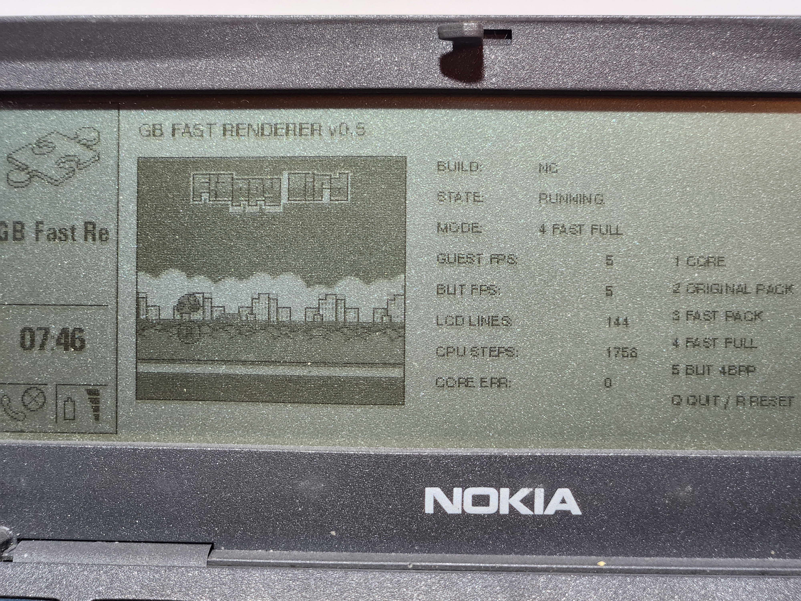
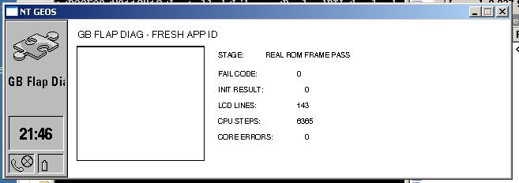

# GB9110

**An experimental AI-assisted Nintendo Game Boy emulator frontend for the Nokia 9110 Communicator and PC/GEOS.**


GB9110 is a work-in-progress port of the [Peanut-GB](https://github.com/deltabeard/Peanut-GB) emulator core to a late-1990s Nokia/GEOS development environment using Borland C++ 4.52.



The project is already past the “hello world” stage:

- a real DMG ROM is loaded from the communicator filesystem;
- the adapted Peanut-GB core executes on the device;
- LCD output is rendered into a GEOS bitmap;
- Game Boy controls are mapped to the communicator keyboard;
- the program runs on an actual Nokia 9110;
- hardware profiling has identified the current bottlenecks.

It is **not yet a usable general-purpose emulator**. The current goal is to make one small test ROM run correctly and fast enough to play, then generalize the frontend.



## Current status

| Component | Status |
|---|---|
| GEOS application shell | Working |
| External 32 KiB ROM loading | Working |
| Peanut-GB CPU core | Working |
| LCD rendering | Working |
| Keyboard input | Working |
| Real Nokia 9110 execution | Working |
| Stable full-speed emulation | Not yet |
| Audio | Not implemented |
| Save RAM / battery saves | Not implemented |
| General ROM compatibility | Not tested |

### Measured on real hardware

The profiler separates emulation, rendering, and GEOS display transfer:

| Test | Result |
|---|---:|
| CPU/core with LCD renderer disabled | 21–22 guest FPS |
| Original Peanut PPU only | 7 guest FPS |
| Original PPU plus 4-bpp packing | 6 guest FPS |
| Full 4-bpp path including GEOS blit | 5 guest FPS |
| Static 160×144 4-bpp GEOS blit | 44 FPS |
| Static 160×144 1-bpp GEOS blit | 29 FPS |

The dominant cost is currently the Game Boy line renderer, not the final GEOS screen transfer.

A first “direct packed” renderer produced no measurable improvement. That negative result is documented rather than hidden: removing one copy was not enough because the inner loop still performed too much per-pixel work and scanned too many sprites.

The current experiment uses lookup tables, four-pixel writes, and per-line sprite lists.

## Repository layout

```text
src/gbhw/                 First hardware-oriented playable frontend
tools/gbprof/             Hardware profiler used to isolate bottlenecks
experiments/gbtable/      Current lookup-table renderer experiment
docs/                     Architecture, history, benchmarks, roadmap
articles/                  Draft development articles in English and Russian
roms/                      ROM policy; no ROM images are distributed
```

## Build environment

The project currently targets the classic Nokia 9110 SDK / PC/GEOS toolchain:

- Nokia 9110 SDK (`N9110V10`)
- Borland C++ 4.52
- GEOS `mkmf`, `pmake`, GOC, and Glue tools
- tested project roots:
  - `C:\PCGEOS\N9110V10`
  - `C:\PCGEOS\User1`

See [BUILDING.md](BUILDING.md) for the exact workflow.

## Quick start

Copy one project into the local GEOS application tree:

```bat
xcopy /E /I src\gbhw C:\PCGEOS\User1\Appl\GBHW
cd /d C:\PCGEOS\User1\Appl\GBHW
mkmf
pmake GBHW.GEO
```

The current frontend expects a user-supplied test ROM named:

```text
FLAPPY.GB
```

The ROM is **not included** in this repository.

For the real communicator, place the normal build and the ROM in:

```text
World\ExtrApps
```

Use `GBHW.GEO`, not the error-checking `GBHWEC.GEO`, on the real device.

## Why this project exists

The Nokia 9110 is an unusually interesting target:

- a real multitasking graphical operating system;
- a 16-bit segmented C environment;
- strict memory and code-resource constraints;
- a wide monochrome display and a full keyboard;
- tooling old enough to punish assumptions that modern platforms make invisible.

Porting an emulator here is not only nostalgia. It is a practical exercise in profiling, memory layout, message-driven scheduling, binary compatibility, and optimization under hard constraints.

## What has already been learned

1. **Raw callback pointers were unsafe in this build environment.**  
   Peanut-GB was adapted to use compile-time direct hooks for ROM access, LCD output, and error reporting.

2. **Application identity matters in GEOS.**  
   Reusing a permanent name/token caused stale-state behavior that looked like a code hang. Fresh identities made diagnostic builds reproducible.

3. **Large globals matter even when `dgroup` looks small.**  
   The framebuffer was moved from uninitialized fixed data into a separately allocated and locked GEOS memory block.

4. **A requested timer rate is not actual emulation speed.**  
   On the PC emulator the frontend reached about 59 guest FPS. On real hardware the same loop exposed the true CPU and PPU cost.

5. **The obvious optimization was not the important one.**  
   Removing the second framebuffer packing pass did not improve FPS. The renderer’s algorithmic cost dominated.

## Roadmap

- validate the lookup-table renderer visually and measure it on hardware;
- reduce PPU cost enough to make the test ROM meaningfully playable;
- profile and optimize the LR35902 instruction loop;
- add adaptive frame skipping without breaking input timing;
- separate ROM loading from the hard-coded test filename;
- implement cartridge RAM and save files;
- add a minimal launcher;
- investigate audio only after stable video performance.

See [ROADMAP.md](ROADMAP.md) for the detailed plan.


## Acknowledgements

GB9110 builds on the work of Mahyar Koshkouei and Peanut-GB, Larold's Retro Gameyard and the Flappy Bird Game Boy homebrew, Marcus Gröber's Nokia 9000/9110 preservation work, and the blueway.Softworks / #FreeGEOS community.

See [ACKNOWLEDGEMENTS.md](ACKNOWLEDGEMENTS.md) for full credits and links.

## Legal and ROM policy

GB9110 does not include commercial ROMs or the test ROM used during development. Users must supply ROM images they are legally entitled to use.

Peanut-GB is MIT-licensed. Its original copyright and license notice are retained in the modified header files. See [NOTICE.md](NOTICE.md).

Nintendo, Game Boy, Nokia, and GEOS are trademarks of their respective owners. This project is unaffiliated with them.

## Project state

This repository should be read as an **open engineering notebook with runnable code**, not as a finished emulator release.

That is intentional. The most useful contribution right now is expertise in:

- 16-bit x86 optimization;
- Borland C++ 4.x code generation;
- PC/GEOS memory and graphics internals;
- Game Boy PPU optimization;
- old Nokia communicator development.
