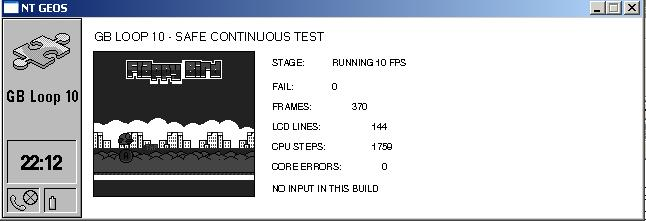
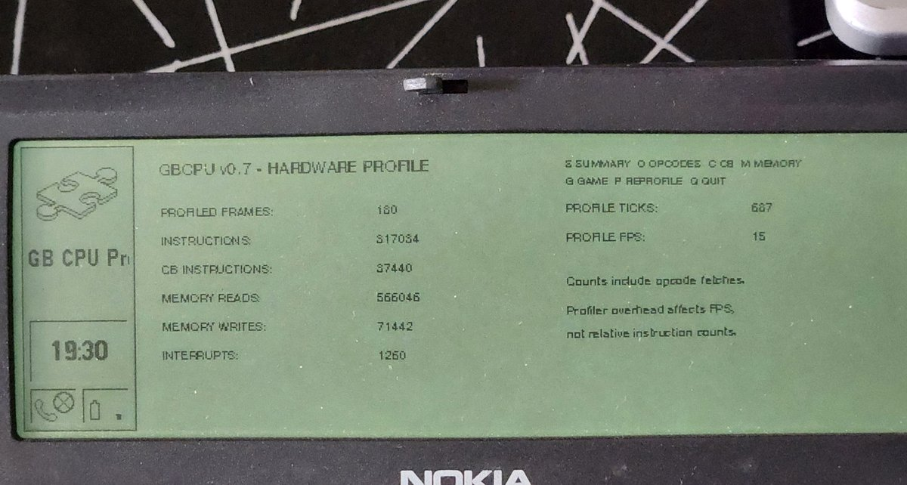
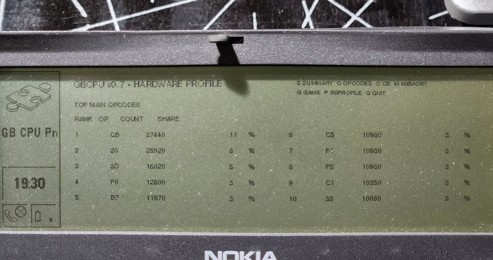

# GB9110

**An AI-assisted, hardware-verified Game Boy emulator experiment for the Nokia 9110 Communicator and PC/GEOS.**

[Русская версия](README_RU.md)



GB9110 ports the compact [Peanut-GB](https://github.com/deltabeard/Peanut-GB) core to the late-1990s Nokia 9110 SDK and Borland C++ 4.52 environment.

The project is beyond a proof-of-concept “hello world”:

- a real DMG ROM is loaded from the communicator filesystem;
- the adapted LR35902 core executes on an actual Nokia 9110;
- Game Boy video is rendered into a GEOS 160×144 4-bpp bitmap;
- controls are mapped to the communicator keyboard;
- CPU, PPU, packing, and GEOS blitting have been profiled separately;
- the complete hardware path has improved from **5 FPS to 13 FPS**.

It is still **not a general-purpose emulator release**. The current objective is to make one small open-source homebrew ROM correct and meaningfully playable before broadening cartridge compatibility.

## Current hardware result

The best measured build is `GBROW v1.3`, combining:

- packed CPU flags and 16-bit-friendly hot paths;
- direct ROM fetch and WRAM stack paths;
- a guarded ROM-specific division-loop superinstruction;
- an eight-pixel ROW8 background renderer;
- GEOS 4-bpp output.

| Path | Real Nokia 9110 result |
|---|---:|
| Original complete renderer path | 5 guest/display FPS |
| Lookup-table renderer (`GBTABLE v0.6`) | 9 guest/display FPS |
| ROW8 renderer (`GBROW v1.3`) | 12 guest/display FPS |
| DIV + ROW8 combined | **13 guest/display FPS** |
| Best CPU-only path | 28 guest FPS |
| Static GEOS 160×144 4-bpp blit | 44 FPS |

The complete path is now **2.6× faster** than the first measured hardware build. Full Game Boy speed has not been reached; CPU execution, rendering, and display transfer are now all material costs.

## Hardware profiling

The profiler runs directly on the communicator and records opcode, memory-access, and interrupt counts.



A 180-frame profile captured:

```text
317,034 main instructions
 37,440 CB-prefixed instructions
566,046 memory reads
 71,442 memory writes
  1,260 serviced interrupts
```

The ten most frequent main opcodes account for roughly half of the instruction stream. Four rotate-through-carry CB instructions account for about 95% of all CB-prefixed operations.



See [HARDWARE_PROFILE.md](docs/HARDWARE_PROFILE.md) and [BENCHMARKS.md](BENCHMARKS.md).

## What worked — and what did not

This repository intentionally keeps negative results.

**Worked:**

- four-pixel lookup-table rendering: packed path `6 → 12 FPS`;
- CPU hot paths: core `22 → 25 FPS`;
- broader CPU cleanup: core reached `27 FPS`;
- division-loop superinstruction: A/B core `26 → 28 FPS`;
- ROW8 rendering: packed `13 → 17 FPS`, full `10 → 12 FPS`;
- DIV + ROW8: full `10 → 13 FPS`.

**Did not work:**

- merely removing the separate packing copy;
- a large decoded tile-row cache, despite a 99.98–100% hit rate;
- broad timing/housekeeping cleanup as a major standalone speedup.

The failed tile cache reduced the full path from 10 to 8 FPS. Its hit path cost more than the original compact LUT decoder.

## Project status

| Component | Status |
|---|---|
| GEOS application shell | Working |
| External 32 KiB ROM loading | Working |
| Adapted Peanut-GB CPU core | Working |
| LCD rendering | Working |
| Keyboard input | Working |
| Real Nokia 9110 execution | Working |
| Profiler on real hardware | Working |
| Full Game Boy speed | Not reached |
| Audio | Not implemented |
| Save RAM / battery saves | Not implemented |
| General ROM compatibility | Not tested |

## Repository layout

```text
src/gbhw/                 Early hardware-oriented playable frontend
tools/gbprof/             Stage profiler: CPU / PPU / pack / blit
tools/gbcpu/              Opcode and memory-access profiler
experiments/gbtable/      First decisive renderer optimization
experiments/gbrow/        Current best ROW8 + DIV benchmark build
docs/                     Architecture, profiling, history, results
articles/                 Development articles in English and Russian
roms/                     ROM policy; ROM images are never distributed
```

Intermediate experiments are documented in [OPTIMIZATION_HISTORY.md](docs/OPTIMIZATION_HISTORY.md). The repository keeps selected reproducible milestones rather than every temporary build.

## Build environment

The tested toolchain is:

- Nokia 9110 SDK (`N9110V10`);
- PC/GEOS build tools;
- Borland C++ 4.52;
- `mkmf`, `pmake`, GOC, and Glue.

Known working roots:

```text
C:\PCGEOS\N9110V10
C:\PCGEOS\User1
```

Build the current experiment:

```bat
xcopy /E /I experiments\gbrow C:\PCGEOS\User1\Appl\GBROW
cd /d C:\PCGEOS\User1\Appl\GBROW
BUILD_GBROW.BAT
```

The current build expects a user-supplied test ROM named:

```text
FLAPPY.GB
```

The ROM is **not included**. On a real communicator, place `GBROW.GEO` and the ROM in:

```text
World\ExtrApps
```

Use the normal `.GEO` build on hardware, not the EC build. See [BUILDING.md](BUILDING.md).

## Controls

```text
Arrow keys   D-pad
Space / Z    A
X            B
Enter        Start
Tab          Select
```

## Development method

The project is AI-assisted, but every meaningful claim is hardware-tested.

AI has been used to inspect source, propose patches, generate diagnostic builds, maintain documentation, and compare profiling data. The human operator installs the historical toolchain, resolves build problems, runs each build on a real Nokia 9110, verifies the image and controls, and records the measurements.

The governing rule is simple: **no optimization is called successful until the real device says so.**

## Why the Nokia 9110?

It is an unusually revealing target:

- a real multitasking graphical operating system;
- a segmented 16-bit x86 C environment;
- strict fixed-data and code-resource constraints;
- a wide monochrome display and full keyboard;
- old tools that expose costs hidden by modern compilers and hardware.

This is nostalgia with instrumentation: emulator architecture, GEOS memory management, event-driven scheduling, old-C portability, and performance engineering under hard constraints.

## Roadmap

The next practical milestone is decoupling guest execution from display updates:

- fixed and adaptive frame skipping;
- independent guest FPS and display FPS;
- input timing verification under skipped frames;
- a lean current build with historical benchmark modes removed;
- then another profiler-guided CPU or assembly experiment.

General cartridge support, save RAM, a ROM chooser, and audio come later. See [ROADMAP.md](ROADMAP.md).

## Acknowledgements and legal notes

GB9110 builds on work by Mahyar Koshkouei / Peanut-GB, Larold's Retro Gameyard and the Flappy Bird Game Boy homebrew, Marcus Gröber's Nokia 9000/9110 preservation work, and the blueway.Softworks / #FreeGEOS community.

See [ACKNOWLEDGEMENTS.md](ACKNOWLEDGEMENTS.md), [NOTICE.md](NOTICE.md), and [roms/README.md](roms/README.md).

Nintendo, Game Boy, Nokia, GEOS, and Flappy Bird are trademarks or properties of their respective owners. GB9110 is an independent, non-commercial engineering project and is not endorsed by them.

## Project state

Treat this repository as an **open engineering notebook with runnable source**, not a finished emulator release.

The most useful contributions today are expertise in:

- 16-bit x86 and Borland C++ 4.x code generation;
- PC/GEOS memory, graphics, and code resources;
- LR35902 dispatch and timing optimization;
- Game Boy PPU rendering;
- development for Nokia Communicator hardware.
