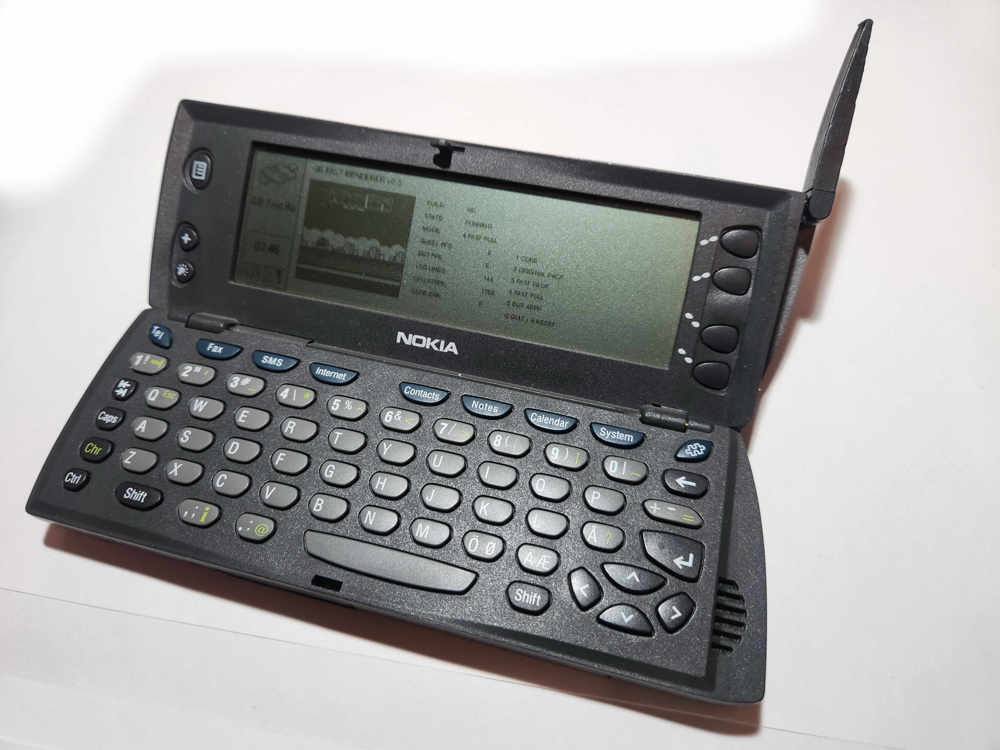

# GB9110

**Экспериментальный эмулятор Nintendo Game Boy для Nokia 9110 Communicator и PC/GEOS, написанный с помощью ИИ.**



GB9110 — незавершённый порт ядра [Peanut-GB](https://github.com/deltabeard/Peanut-GB) в среду Nokia 9110 SDK и Borland C++ 4.52.


Проект уже работает не только в эмуляторе SDK:

- настоящий ROM загружается из файловой системы коммуникатора;
- адаптированное ядро Peanut-GB выполняет код игры;
- LCD Game Boy выводится в GEOS bitmap;
- клавиши Game Boy привязаны к клавиатуре Nokia;
- приложение запускается на реальной Nokia 9110;
- проведено раздельное профилирование CPU, PPU и вывода GEOS.

Это пока **не готовый пользовательский эмулятор**. Текущая задача — добиться корректной и приемлемой скорости на одном небольшом тестовом ROM, а уже затем расширять совместимость.


## Текущее состояние

| Компонент | Состояние |
|---|---|
| Оболочка приложения GEOS | Работает |
| Загрузка внешнего ROM 32 КиБ | Работает |
| CPU-ядро Peanut-GB | Работает |
| LCD-рендеринг | Работает |
| Управление | Работает |
| Запуск на реальной Nokia 9110 | Работает |
| Полная скорость | Пока нет |
| Звук | Не реализован |
| Save RAM | Не реализован |
| Совместимость с разными ROM | Не проверена |

## Измерения на реальном аппарате

| Режим | Результат |
|---|---:|
| CPU без LCD-рендерера | 21–22 гостевых FPS |
| Оригинальный PPU Peanut-GB | 7 FPS |
| PPU и упаковка в GEOS 4-bpp | 6 FPS |
| Полный путь с выводом | 5 FPS |
| Статический вывод 160×144 4-bpp | 44 FPS |
| Статический вывод 160×144 1-bpp | 29 FPS |

Главный тормоз сейчас — рендерер строк Game Boy, а не финальный вывод картинки средствами GEOS.

Первая попытка прямого packed-рендеринга не дала прироста. Это не спрятано: удаление одного копирования оказалось недостаточным, поскольку тяжёлым остался сам внутренний цикл рендерера.

Текущий эксперимент использует таблицы декодирования, запись сразу четырёх пикселей и заранее подготовленные списки спрайтов по строкам.

## Структура

```text
src/gbhw/                 Первая аппаратная игровая сборка
tools/gbprof/             Профилировщик для реальной Nokia
experiments/gbtable/      Текущий табличный рендерер
docs/                     Архитектура, история, измерения и план
articles/                  Черновики статей на русском и английском
roms/                      Правила по ROM; сами ROM не распространяются
```

## Сборка

Используется классическая среда:

- Nokia 9110 SDK (`N9110V10`);
- Borland C++ 4.52;
- `mkmf`, `pmake`, GOC и Glue;
- рабочие корни:
  - `C:\PCGEOS\N9110V10`;
  - `C:\PCGEOS\User1`.

Подробности: [BUILDING.md](BUILDING.md).

Пример:

```bat
xcopy /E /I src\gbhw C:\PCGEOS\User1\Appl\GBHW
cd /d C:\PCGEOS\User1\Appl\GBHW
mkmf
pmake GBHW.GEO
```

Текущая версия ожидает пользовательский тестовый ROM:

```text
FLAPPY.GB
```

ROM в репозиторий не входит.

На реальный аппарат устанавливается обычная сборка:

```text
GBHW.GEO
```

а не `GBHWEC.GEO`.

## Зачем это делается

Nokia 9110 — интересная инженерная цель:

- настоящая многозадачная графическая ОС;
- 16-битная сегментированная модель памяти;
- жёсткие ограничения на данные и code resources;
- широкий монохромный экран и полноценная клавиатура;
- инструменты, которые моментально выявляют скрытые издержки архитектуры.

Это не только ностальгия. Проект уже превратился в практику профилирования, работы с памятью GEOS, событийного цикла, совместимости старого C и оптимизации эмулятора.


## Благодарности

GB9110 опирается на работу Mahyar Koshkouei и Peanut-GB, Larold's Retro Gameyard и homebrew-версии Flappy Bird для Game Boy, материалы Marcus Gröber по Nokia 9000/9110, а также работу blueway.Softworks и сообщества #FreeGEOS.

Полные благодарности и ссылки: [ACKNOWLEDGEMENTS_RU.md](ACKNOWLEDGEMENTS_RU.md).

## Статус проекта

Репозиторий следует воспринимать как **открытый инженерный журнал с запускаемым кодом**, а не как релиз готового эмулятора.

Сейчас особенно полезны знания в областях:

- оптимизация 16-битного x86;
- особенности Borland C++ 4.x;
- память и графика PC/GEOS;
- оптимизация PPU Game Boy;
- разработка для старых Nokia Communicator.
