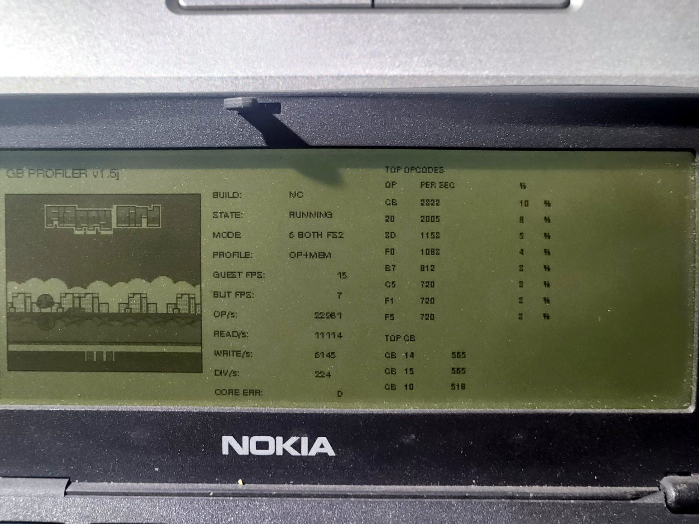

# LR35902 hardware profiles

GB9110 now has two complementary real-device profiles:

1. `GBCPU v0.7`: a 180-frame cumulative profile of the earlier interpreter;
2. `GBPROF v1.5j`: a rate-based profile of the current ROW8/DIV workload.

The first profile drove the early CPU changes. The second profile determines the next assembly experiment.

## 1. Original cumulative profile: GBCPU v0.7

```text
Profiled frames:      180
Main instructions:    317,034
CB instructions:       37,440
Memory reads:         566,046
Memory writes:         71,442
Serviced interrupts:    1,260
Profiler ticks:           687
Profiler FPS:              15
```

Profiler FPS includes heavy counter overhead and must not be compared directly with a clean CPU-only benchmark.

### Main opcode top ten

| Rank | Opcode | Meaning | Count | Approx. share |
|---:|---:|---|---:|---:|
| 1 | `CB` | CB prefix | 37,440 | 11% |
| 2 | `20` | `JR NZ,r8` | 25,920 | 8% |
| 3 | `3D` | `DEC A` | 16,020 | 5% |
| 4 | `F0` | `LDH A,(a8)` | 12,600 | 3% |
| 5 | `B7` | `OR A` | 11,970 | 3% |
| 6 | `C5` | `PUSH BC` | 10,980 | 3% |
| 7 | `F1` | `POP AF` | 10,980 | 3% |
| 8 | `F5` | `PUSH AF` | 10,980 | 3% |
| 9 | `C1` | `POP BC` | 10,350 | 3% |
| 10 | `38` | `JR C,r8` | 10,080 | 3% |

### CB-prefixed hot set

| Opcode | Meaning | Count |
|---:|---|---:|
| `14` | `RL H` | 9,180 |
| `15` | `RL L` | 9,180 |
| `10` | `RL B` | 8,640 |
| `11` | `RL C` | 8,640 |

These four commands represent about 95% of all CB-prefixed instructions in the captured workload and belong to the division routine later targeted by DIV v1/v2.

### Memory distribution

Opcode and immediate-byte fetches were included in this original profile.

| Read region | Count | Share |
|---|---:|---:|
| ROM0 | 426,402 | 75.3% |
| WRAM | 102,924 | 18.2% |
| HRAM | 24,300 | 4.3% |
| I/O | 12,420 | 2.2% |

| Write region | Count | Share |
|---|---:|---:|
| WRAM | 66,222 | 92.7% |
| I/O | 4,860 | 6.8% |
| HRAM | 360 | 0.5% |

### Optimizations derived from GBCPU v0.7

- direct fixed-bank instruction fetch;
- fast WRAM stack path;
- direct handling of hot CB rotates;
- packed flag register;
- high-memory fast paths;
- exact-signature division-loop helpers.

## 2. Current rate-based profile: GBPROF v1.5j

`GBPROF v1.5j` measures a two-second rolling window on the current engine. It can profile opcode frequency, data-memory traffic or both while running FS2.


### Opcode-core sample

```text
Guest FPS: 26
OP/s:      28,126
DIV/s:        870
```

| Opcode | Meaning | Per second | Share |
|---:|---|---:|---:|
| `20` | `JR NZ,r8` | 3,775 | 13% |
| `F0` | `LDH A,(a8)` | 2,228 | 7% |
| `80` | `ADD A,B` | 1,720 | 6% |
| `E6` | `AND d8` | 1,247 | 4% |
| `C6` | `ADD A,d8` | 1,195 | 4% |
| `28` | `JR Z,r8` | 990 | 3% |
| `E0` | `LDH (a8),A` | 954 | 3% |
| `21` | `LD HL,d16` | 840 | 3% |

The top eight account for about 43% of the captured stream. The mix differs from the original cumulative profile because the current engine already contains several fast paths and because the sample is a shorter live window.

### Data-memory sample

Opcode and immediate-byte fetches are excluded.


```text
Guest FPS: 24
Reads/s:   19,135
Writes/s:   7,759
DIV/s:        848
```

| Region | Reads/s | Writes/s |
|---|---:|---:|
| WRAM | 12,408 | 6,862 |
| HRAM | 4,657 | 69 |
| I/O | 2,070 | 828 |

WRAM represents about 65% of data reads and 88% of data writes in this sample. HRAM is the second-largest read source because `LDH` instructions are frequent.

### Combined opcode + memory under FS2



```text
Guest FPS: 15
Blit FPS:   7
OP/s:      22,501
Reads/s:   11,114
Writes/s:   6,145
DIV/s:        224
```

These FPS figures include all profiling overhead. The useful observation is that the hot-opcode order changes under the combined workload; therefore a broad rewrite based only on one frozen-render sample would be premature.

## Assembly implications

The current evidence supports a controlled first experiment around:

- conditional relative branches (`JR NZ`, `JR Z`);
- immediate ALU operations (`AND d8`, `ADD A,d8`);
- high-memory access (`LDH A,(a8)`, `LDH (a8),A`);
- register ALU (`ADD A,B`);
- immediate 16-bit load (`LD HL,d16`);
- or the common dispatch/fetch/flag machinery shared by these instructions.

It does **not** yet justify rewriting the full LR35902 interpreter. Function-call and segment-transition overhead may erase the gain from tiny standalone handlers, so the first ASM path must be measured in the same binary against C.
